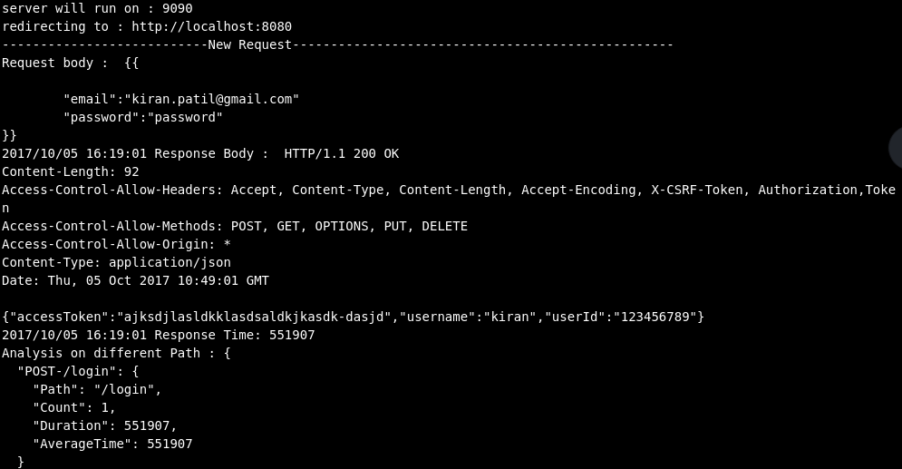

# Reverse Proxy In Go With Performance Analysis

## Getting Started

Just Pull this go source code and run the binary file. This is built in order to analyze the HTTP traffic that is coming to your server.

HTTP Traffic from outside <-> GoProxy Server <-> Main Server

This goproxy server is responsible for accepting the HTTP request from outside world and route them to the actual server. The current version of this proxy server helps to analyze the server like response time, average response time for a particular path, printing request and response body for every HTTP request etc. The output is set to a terminal where you run the binary file.

This Server prints request body & response body of every request. Used http.DumpResponse which helps to copy the http response in a string format.

### Prerequisites

Go Version 1.6
if not installed you can follow this documentation https://golang.org/doc/install

```
Give examples
```

## Deployment
You can run the program with the "port" and "url" sent as command line arguments. If not set by default Reverse Proxy will be running on port 9090 and it will be redirecting the request to http://localhost:8080.

Make sure you run your program at 8080 port or specify port while running the program.

Run Commands:

If you want to host ReverseProxy on 9090 and redirect the request to the port 5000 , run following command
./ReverseProxy -port=9090 -url=http://localhost:5000
or
./ReverseProxy

Note: If you modify anything in the code please do build the code once so that new binary file will be generated and you run the modified binary go file to get expected results.

## Output

When you run the ReverseProxy server, It will print the port where Reverse Proxy is running and where it is redirecting the request to.


Following screenshot shows the things that are captured after making one of the login POST request through reverse proxy.




Whenever there is a http request , we are printing request body and response body along with headers.Along with that we are measuring the time for each api. Currently we are storing the total response time, total no of api calls for a particular path.

Thanks!
